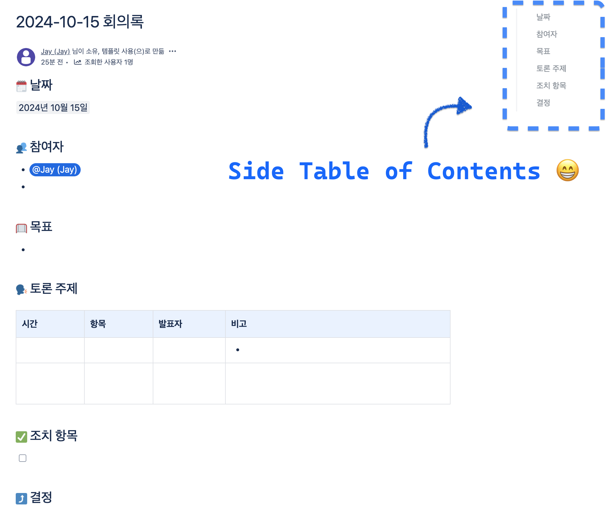

<h1 align="center"> Confluence Side TOC</h1>

A side table of contents for Confluence.

While reading a long document in Confluence, I realized that it was inconvenient to navigate to the area I wanted to find, so I created a table of contents pinned to a side area.
